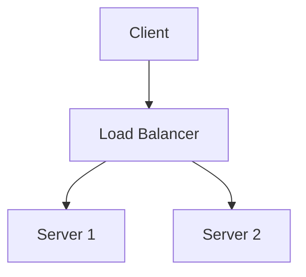

<p align="center">
  
</p>

<h1 align="center">PiMD</h1>

<p align="center">
  <em>Professional document generation and publishing framework for Python.</em>
</p>

<p align="center">
  <a href="https://pypi.org/project/pimd/"></a>
  <a href="https://pypi.org/project/pimd/"></a>
  <a href="https://pypi.org/project/pimd/"></a>
  <a href="https://github.com/devasishpal/PiMd/actions"></a>
  <a href="https://github.com/devasishpal/PiMd/actions"></a>
  <a href="https://github.com/devasishpal/PiMd/blob/main/CHANGELOG.md"></a>
</p>

---

**PiMD** (Python Markdown Publisher) converts Markdown, HTML, and documentation repositories into professional DOCX documents — books, reports, technical manuals, research papers, invoices, and more. It runs entirely offline with zero cloud dependencies.

---

- [What is PiMD?](#what-is-pimd)
- [Why PiMD?](#why-pimd)
- [Key Features](#key-features)
- [Quick Start](#quick-start)
- [Architecture](#architecture)
- [Feature Showcase](#feature-showcase)
- [DOCX Quality](#docx-quality)
- [Diagram Support](#diagram-support)
- [Scientific Publishing](#scientific-publishing)
- [Templates](#templates)
- [Plugin Ecosystem](#plugin-ecosystem)
- [Backend Integration](#backend-integration)
- [CLI Reference](#cli-reference)
- [Configuration](#configuration)
- [Performance](#performance)
- [Project Structure](#project-structure)
- [Roadmap](#roadmap)
- [Contributing](#contributing)
- [License](#license)

---

## What is PiMD?

PiMD is a **document generation and publishing framework** for Python. It takes structured text formats — Markdown, HTML, documentation repositories — and produces **publish-ready DOCX output** with professional typography, diagrams, equations, citations, cross-references, tables of contents, headers and footers.

Unlike simple Markdown-to-DOCX converters, PiMD provides:

- A **full document model** — headings, paragraphs, code blocks, tables, lists, images, diagrams, equations, callouts, and footnotes are all first-class citizens
- A **plugin architecture** and **Extension SDK** for custom renderers, parsers, and publishing pipelines
- A **template engine** with inheritance, 10 preset templates, and full customization
- **Diagram rendering** from Mermaid, PlantUML, Graphviz, D2, BlockDiag, Vega, BPMN, and ASCII art
- **Equation rendering** with LaTeX, MathJax, KaTeX, and native Word OMML
- **Scientific publishing** — cross-references, bibliography, equation numbering, figure numbering
- **Enterprise features** — incremental builds, parallel processing, streaming, caching, safety guards, accessibility validation

PiMD is designed to be used both as a **Python library** (integrate into FastAPI, Flask, Django, or any Python application) and as a **standalone CLI tool** for batch processing, watch mode, and CI/CD pipelines.

## Why PiMD?

### vs Pandoc

| | PiMD | Pandoc |
|---|---|---|
| **Primary output** | DOCX with professional-quality rendering | General-purpose document conversion |
| **Templates** | Built-in template engine with 10 presets | Template system via partials |
| **Diagrams** | Mermaid, PlantUML, Graphviz, D2, BlockDiag, Vega, BPMN, ASCII | None built-in |
| **Equations** | LaTeX, MathJax, KaTeX, native Word OMML | LaTeX via MathJax |
| **Plugin system** | Full plugin architecture with SDK | Filters and custom writers |
| **Python API** | First-class library API | Haket filters or shell |
| **Accessibility** | Built-in WCAG validation | None |

PiMD focuses on producing **publish-ready DOCX output** with professional styling, diagrams, and equations — not general-purpose format conversion.

### vs Sphinx

| | PiMD | Sphinx |
|---|---|---|
| **Input format** | Markdown, HTML | reStructuredText (primary) |
| **Output format** | DOCX-focused, multi-format | HTML, PDF, ePub, LaTeX |
| **Setup complexity** | Zero — runs on any Markdown | Requires conf.py, roles, directives |
| **API integration** | Native Python library | Subprocess or extension hooks |
| **Diagrams** | 12 renderers included | Via extensions |
| **Learning curve** | Minimal — standard Markdown | Requires RST expertise |

PiMD is for teams that want to **publish from standard Markdown** without adopting a new markup language or complex build system.

### vs MkDocs

| | PiMD | MkDocs |
|---|---|---|
| **Primary output** | DOCX, PDF | HTML websites |
| **Use case** | Print publishing, reports, books | Technical documentation websites |
| **Templates** | DOCX-centric templates | HTML themes |
| **Offline** | Fully offline | Offline |
| **Plugin system** | 9 plugin types | MkDocs plugins |

MkDocs builds documentation websites; PiMD produces **print-ready documents** from the same Markdown source.

### vs Traditional Markdown Converters

Most Markdown-to-DOCX converters are thin wrappers around `python-docx` with basic formatting. PiMD provides:

- A full **document model** with typed blocks (heading, table, diagram, equation, code, callout, footnote)
- **Diagram rendering** integrated into the conversion pipeline
- **Equation rendering** with multiple backends
- **Template system** with inheritance and configuration
- **Plugin architecture** with hooks at every pipeline stage
- **Observability** — metrics, profiling, execution reports
- **Safety guards** — path traversal protection, input validation, resource limits

## Key Features

### Markdown Support

Full CommonMark + GitHub Flavored Markdown: headings, paragraphs, inline formatting, code blocks with syntax highlighting, tables with alignment, task lists, blockquotes, horizontal rules, footnotes, callouts, frontmatter metadata.

### HTML Support

Converts HTML documents — inline styles, classes, semantic elements — preserving structure and formatting.

### DOCX Generation

Publish-quality DOCX output with professional typography, A4 layout, configurable margins, headers/footers, page numbering, table of contents, cross-references, and automatic numbering.

### Professional Templates

10 built-in template presets with configurable fonts, colors, page sizes, margins, headers, footers, watermarking, and cover pages.

### Diagram Rendering

Mermaid, PlantUML, Graphviz, D2, BlockDiag (seqdiag, actdiag, nwdiag, packetdiag), Vega, BPMN, and ASCII art — all rendered inline in DOCX output.

### Scientific Publishing

Cross-references, bibliography (APA, IEEE, MLA, Chicago, Harvard), equation numbering, figure numbering, table numbering, citing, and native Word equation (OMML) support.

### Asset Management

Remote asset downloads with SHA256 caching, domain allowlisting, offline mode, MIME detection.

### Repository Conversion

Convert MkDocs, Sphinx, Docusaurus, and Obsidian documentation repositories to DOCX.

### Book Publishing

Compile multi-chapter books from configuration files with unified styling, consistent numbering, cross-chapter references, and generated table of contents.

### Batch Processing

Convert entire directories of Markdown/HTML files with parallel processing, progress display, and error reporting.

### Plugin System

9 plugin types (diagram, template, citation, renderer, exporter, asset, validation, parser, publishing) with entry-point discovery, lifecycle hooks, dependency management, and diagnostics.

### Backend Integration

First-class Python API for FastAPI, Flask, Django, and any Python application. In-memory conversion, bytes output, streaming responses.

### CLI Interface

40+ commands: conversion, diagrams, equations, templates, branding, reports, books, citations, merge, batch, validate, project, config, cache, jobs, profile, watch, build, accessibility, and more.

### Enterprise Publishing

Incremental builds, parallel processing, streaming large files, caching with memory/filesystem/Redis backends, safety guards, observability with metrics and profiling, accessibility WCAG validation.

### Multi-Format Export

DOCX, PDF, HTML, Markdown, RTF, ODT, TXT — with a consistent public API for all formats.

### Accessibility Validation

Built-in engine checks for WCAG 1.1.1 (alt text), 1.3.1 (table headers), 2.4.10 (heading hierarchy), 4.1.1 (structure), and generates markdown reports with scores.

## Quick Start

### Installation

**From source (current — pre-PyPI):**

```bash
git clone https://github.com/devasishpal/PiMd.git
cd PiMd
pip install -e .                    # Core only
pip install -e ".[all]"             # Core + all optional features
```

**From PyPI:**

```bash
pip install pimd                      # Core only (CLI + basic conversion)
pip install "pimd[all]"               # Core + all runtime features
pip install "pimd[full]"              # Everything including dev tools
```

Optional extras can be combined individually:

```bash
pip install "pimd[diagrams]"       # Diagram rendering (Pillow)
pip install "pimd[equations]"      # Equation rendering (matplotlib)
pip install "pimd[export]"         # PDF export
pip install "pimd[citations]"      # BibTeX support
pip install "pimd[redis]"          # Redis cache backend
pip install "pimd[profiling]"      # Performance profiling
```

All core dependencies (`markdown-it-py`, `mdit-py-plugins`, `python-docx`, `beautifulsoup4`, `lxml`, `typer`, `rich`, `pyyaml`) auto-install with any variant — no manual steps needed.

### Python API

```python
from pimd import PiMD

engine = PiMD()

# Convert file to file
engine.md_to_docx("input.md", "output.docx")

# Convert string to bytes (no filesystem writes)
docx_bytes = engine.md_text_to_docx_bytes("# Hello World")

# Convert HTML to DOCX
engine.html_to_docx("page.html", "page.docx")

# Convert with options
engine.md_to_docx(
    "report.md",
    "report.docx",
    generate_toc=True,
    page_numbers=True,
    title="Annual Report",
    author="Jane Smith",
)
```

### CLI

```bash
# Convert Markdown to DOCX
pimd md guide.md guide.docx

# Convert HTML to DOCX
pimd html page.html page.docx

# List available templates
pimd template list

# Generate a report
pimd report generate executive

# Watch a directory for changes
pimd watch ./docs --output ./build

# Check version
pimd --version
```

### Backend Server

FastAPI:

```python
from fastapi import FastAPI, File, UploadFile, Form
from fastapi.responses import Response
from pimd import PiMD

app = FastAPI()
engine = PiMD()

@app.post("/convert")
async def convert(file: UploadFile = File(...)) -> Response:
    content = await file.read()
    docx_bytes = engine.md_text_to_docx_bytes(content.decode())
    return Response(
        content=docx_bytes,
        media_type="application/vnd.openxmlformats-officedocument.wordprocessingml.document",
    )
```

See `examples/fastapi_app.py`, `examples/flask_example.py`, `examples/django_example.py` for complete integration examples.

## Architecture

PiMD follows a layered architecture with clear separation of concerns:

```
┌─────────────────────────────────────────────────────┐
│                    CLI Layer                        │
│   pimd md, pimd html, pimd build, pimd watch ...    │
├─────────────────────────────────────────────────────┤
│                   API Layer                         │
│              PiMD class, convert()                  │
├─────────────────────────────────────────────────────┤
│                Service Layer                        │
│  ConversionService, DocumentService, TemplateService│
├─────────────────────────────────────────────────────┤
│               Pipeline Layer                        │
│     Parse → Transform → Render → Export + Hooks     │
├─────────────────────────────────────────────────────┤
│  Parsers  │  Renderers  │  Engines  │  Plugins      │
│  Markdown │  DOCX       │  Diagram  │  Conversion   │
│  HTML     │  PDF        │  Equation │  Lifecycle    │
│           │  HTML       │  Template │  Extension    │
│           │  TXT        │  Citation │               │
├─────────────────────────────────────────────────────┤
│              Domain Model Layer                     │
│    Document, Block, Span, Heading, Table, Image...  │
├─────────────────────────────────────────────────────┤
│           Infrastructure Layer                      │
│  Cache (memory/fs/redis) │ Safety │ Observability   │
│  Config │ Incremental │ Parallel │ Streaming        │
└─────────────────────────────────────────────────────┘
```

### Parsers

Two built-in parsers convert source text into PiMD's document model:

- **MarkdownParser** — CommonMark + GFM with extensions for frontmatter, footnotes, callouts, diagrams, equations, cross-references
- **HTMLParser** — HTML to document model via BeautifulSoup with structure preservation

Each parser implements a `parse(text: str) -> Document` interface. Custom parsers can be registered via the plugin system.

### Document Model

The document model (`pimd.models`) is a typed hierarchy of block-level elements:

```
Document
├── Heading (level, text, id)
├── Paragraph (spans with bold/italic/code/links/images)
├── CodeBlock (language, code)
├── Table (headers, rows, alignment)
├── OrderedList / BulletList (items with nested children)
├── Image (url, alt, width, height)
├── Diagram (language, source, png_bytes, svg_bytes)
├── EquationBlock (latex, omml, svg)
├── HorizontalRule
├── Callout (type, title, blocks)
├── Footnote (ref_id, text)
└── Blockquote (blocks)
```

This model is the single source of truth that flows through the pipeline. Every renderer, plugin, and transformation operates on it.

### Renderers

- **DOCX Renderer** (primary) — produces publish-quality DOCX via `python-docx` with full styling, TOC, headers/footers, watermarks
- **HTML Renderer** — generates HTML output
- **PDF** — via DOCX-to-PDF conversion (weasyprint on Linux/Mac, docx2pdf on Windows)
- **EPUB, LaTeX, PPTX** — stub architecture for future releases

### Publishing Engine

The publishing layer orchestrates multi-part documents:

- **Book Compiler** — compiles chapters from config, applies consistent templates, generates TOC
- **Report Engine** — generates structured reports from templates (executive, technical, research, compliance, architecture, etc.)
- **Template Engine** — manages template presets, inheritance chains, config merging

### Diagram Engine

Diagram rendering is fully integrated into the conversion pipeline. Code blocks with recognized language hints are automatically detected and rendered:

- Auto-detection of diagram languages from code block content
- 12 built-in renderers with availability detection
- Plugin architecture for custom renderers
- Caching with memory, filesystem, and Redis backends
- Automatic fallback — if a renderer is unavailable, the pipeline continues

### Equation Engine

Equations are rendered inline and display-mode from LaTeX syntax:

- Detects `$...$` and `$$...$$` in Markdown and HTML
- Multiple rendering backends (matplotlib, MathJax-based)
- Native Word OMML output for perfect DOCX rendering
- Equation numbering and cross-references
- Chemical formula support
- Caching with configurable TTL

### Template Engine

Templates control the visual output of documents:

- **10 presets** — professional, academic, technical, business, book, proposal, invoice, resume, manual, API
- **Inheritance** — templates can extend parent templates with overrides
- **Config** — page size, margins, fonts, colors, headers, footers, TOC, cover pages, watermarks
- **Validation** — built-in template validation
- **Custom** — create new templates with JSON configuration

### Plugin System

The plugin system (`pimd.plugins`) provides hooks at every stage of the conversion pipeline:

- **Conversion hooks**: `BEFORE_PARSE`, `AFTER_PARSE`, `BEFORE_RENDER`, `AFTER_RENDER`, `BEFORE_CONVERT`, `AFTER_CONVERT`
- **Plugin types**: diagram, template, citation, renderer, exporter, asset, validation, parser, publishing
- **SDK**: `pimd.sdk` provides `BasePlugin` with typed subclasses for each plugin type
- **Discovery**: plugins can be discovered via entry points (`pimd.plugins` group) or filesystem
- **Lifecycle**: `on_install`, `on_uninstall`, `on_enable`, `on_disable` hooks
- **Dependencies**: plugins can declare dependencies on other plugins

### Service Layer

`ConversionService` orchestrates the full pipeline with:

- Input validation (safety checks, file size, nesting depth)
- Cache lookups (memory/filesystem/Redis)
- Plugin hook dispatch at every stage
- Diagram and equation processing
- Statistics collection
- Metrics and observability (parse time, render time, total time, block counts)
- Error handling with graceful degradation

## Feature Showcase

### Markdown → DOCX

`sample.md`:
```markdown
# PiMD Sample Document

This is a sample Markdown file used for testing PiMD conversion.

## Features

- Paragraphs with **bold** and *italic* text
- [Links](https://example.com)
- Lists (ordered and unordered)
- Code blocks
```

```bash
pimd md sample.md output.docx
```

### HTML → DOCX

`sample.html`:
```html
<!DOCTYPE html>
<html lang="en">
<head><title>PiMD Sample Document</title></head>
<body>
    <h1>PiMD Sample Document</h1>
    <p>This is a sample HTML file used for testing PiMD conversion.</p>
</body>
</html>
```

```bash
pimd html sample.html output.docx
```

### Diagrams

```markdown
## Architecture Overview


```

PiMD detects the `mermaid` language hint and renders the diagram as an embedded image in the DOCX output.

### Equations

```markdown
The quadratic formula:

$$ x = \frac{-b \pm \sqrt{b^2 - 4ac}}{2a} $$

Inline equation: $E = mc^2$
```

Equations are rendered as native Word OMML or SVG depending on the backend.

### Templates

```bash
# List available templates
pimd template list

# Convert with a specific template
pimd md report.md report.docx --template academic

# Get template details
pimd template info academic
```

### Books

```bash
pimd book compile book-config.json output.docx
```

Where `book-config.json` defines chapters, styling, and metadata.

### Reports

```bash
# List available report types
pimd report list-types

# Generate a report
pimd report generate executive --title "Q4 Review" --output report.docx
```

### Repository Conversion

```bash
# Convert an MkDocs project
pimd repo ./docs --output documentation.docx

# Convert with frontmatter handling
pimd frontmatter extract ./post.md
```

## DOCX Quality

PiMD produces publication-quality DOCX output:

| Feature | Description |
|---|---|
| **Layout** | A4 (default), Letter, or custom page size |
| **Margins** | Normal (2.54 cm), Narrow (1.27 cm), or custom |
| **Typography** | Professional fonts (Calibri default), configurable heading/body fonts |
| **Font sizes** | Configurable per heading level and body text |
| **Line spacing** | Configurable (default 1.15) |
| **Paragraph spacing** | Configurable (default 6 pt after) |
| **Headers** | Configurable header text per section |
| **Footers** | Configurable footer text, page numbering |
| **Table of Contents** | Auto-generated from heading hierarchy |
| **Cross-references** | Heading references, figure references, table references |
| **Numbering** | Heading numbering, figure numbering, table numbering, equation numbering |
| **Citations** | APA, IEEE, MLA, Chicago, Harvard with full bibliography |
| **Cover pages** | Configurable cover page with title, author, date |
| **Watermarks** | Configurable text watermarking |
| **Images** | Embedded with alt text, sizing, positioning |
| **Diagrams** | High-resolution embedded PNG/SVG |
| **Equations** | Native Word OMML for perfect rendering |
| **Tables** | Formatted with headers, borders, alignment |
| **Code blocks** | Monospace font, syntax-highlighted (via formatting) |
| **Hyperlinks** | Clickable links preserved |
| **Accessibility** | Alt text, heading hierarchy, table headers |

## Diagram Support

PiMD includes a universal diagram engine with built-in renderers for:

| Renderer | Language hint | Auto-detect | Output |
|---|---|---|---|
| [Mermaid](https://mermaid.js.org/) | `mermaid` | Yes | PNG, SVG |
| [PlantUML](https://plantuml.com/) | `plantuml` | Yes | PNG, SVG |
| [Graphviz](https://graphviz.org/) | `dot`, `graphviz` | Yes | PNG, SVG |
| [D2](https://d2lang.com/) | `d2` | Yes | PNG, SVG |
| [BlockDiag](http://blockdiag.com/) | `blockdiag` | Yes | PNG |
| [SeqDiag](http://blockdiag.com/seqdiag/) | `seqdiag` | Yes | PNG |
| [ActDiag](http://blockdiag.com/actdiag/) | `actdiag` | Yes | PNG |
| [NwDiag](http://blockdiag.com/nwdiag/) | `nwdiag` | Yes | PNG |
| [PacketDiag](http://blockdiag.com/packetdiag/) | `packetdiag` | Yes | PNG |
| [Vega](https://vega.github.io/) | `vega` | Yes | PNG |
| [BPMN](https://en.wikipedia.org/wiki/Business_Process_Model_and_Notation) | `bpmn` | Yes | PNG |
| ASCII Art | `ascii` | Yes | SVG |

### Auto-Detection

When a code block has no language hint, PiMD inspects the content for box-drawing characters, connector patterns, and structural indicators to automatically detect diagram types.

### Custom Renderers

```python
from pimd.sdk import DiagramPlugin

class MyDiagramRenderer(DiagramPlugin):
    name = "my_renderer"
    version = "1.0.0"

    def render(self, source: str, language: str, **kwargs):
        # Return RenderResult with png_bytes and/or svg_bytes
        ...
```

Register your renderer:

```python
from pimd.diagrams import register_diagram_renderer
register_diagram_renderer(MyDiagramRenderer())
```

### Architecture

```
CodeBlock (language="mermaid")
    │
    ▼
Diagram Engine
    │
    ├─ Auto-detect language (if not specified)
    ├─ Find registered renderer
    ├─ Check cache
    ├─ Render (subprocess or library)
    ├─ Cache result
    └─ Return Diagram block
    │
    ▼
DOCX Renderer (embeds PNG/SVG in document)
```

## Scientific Publishing

PiMD provides comprehensive support for scientific and technical document publishing.

### Equation Rendering

```markdown
The Fourier transform is defined as:

$$ \hat{f}(\omega) = \int_{-\infty}^{\infty} f(t) e^{-i\omega t} \, dt $$

Where $f(t)$ is a continuous function and $\omega$ is angular frequency.
```

- **LaTeX syntax** — standard `$...$` inline and `$$...$$` display
- **Multiple backends** — Content MathML, matplotlib rendering, LaTeX-based
- **Native OMML** — equations are converted to native Word OMML for perfect inline rendering with Word's equation engine
- **SVG fallback** — when OMML conversion is unavailable, equations are rendered as SVG images
- **Equation numbering** — automatic `(1)`, `(2)` numbering with `\label{eq:foo}` and `\ref{eq:foo}` cross-references
- **Chemical formulas** — support for chemical notation via `\ce{}` syntax (mhchem-compatible)

### Bibliography

```python
from pimd import CitationEngine, CitationStyle

engine = CitationEngine()
engine.load_bibtex("references.bib")
citations = engine.cite("Einstein1915", style=CitationStyle.APA)
bibliography = engine.bibliography(style=CitationStyle.IEEE)
```

Supported citation styles:

- **APA** (American Psychological Association)
- **IEEE** (Institute of Electrical and Electronics Engineers)
- **MLA** (Modern Language Association)
- **Chicago** (Chicago Manual of Style)
- **Harvard** (Harvard referencing)

### Cross-References

```markdown
As shown in @fig:architecture, the system...

See @tbl:results for experimental data.

Equation @eq:fourier describes the transform.
```

Cross-references to figures, tables, equations, and headings are resolved during rendering and converted to Word cross-reference fields.

## Templates

PiMD includes 10 professionally designed template presets:

| Template | Best for | Config highlights |
|---|---|---|
| **Professional** | General business documents | A4, Calibri, 11pt, TOC optional |
| **Academic** | Research papers, theses | A4, Times New Roman, 12pt, TOC, line numbers |
| **Technical** | Manuals, specifications | A4, Calibri, 10pt, TOC, page numbers |
| **Business** | Proposals, reports | A4, Calibri, 11pt, TOC, cover page |
| **Book** | Full-length publications | A4, Calibri, 11pt, TOC, chapters, headers |
| **Proposal** | Business proposals | A4, Calibri, 11pt, cover page, TOC |
| **Invoice** | Billing documents | A4, Calibri, 10pt, header/footer |
| **Resume** | CVs and resumes | A4, Calibri, 10pt, compact margins |
| **Manual** | Product documentation | A4, Calibri, 10pt, TOC, numbered headings |
| **API** | API documentation | A4, Calibri, 10pt, TOC, code blocks |

### Template Inheritance

Templates support inheritance chains. A child template can override specific settings while inheriting the rest from its parent:

```json
{
    "metadata": {
        "name": "my_academic",
        "tags": ["base_academic"]
    },
    "config": {
        "default_font": "Georgia",
        "line_spacing": 1.5
    }
}
```

### Custom Templates

Create a template directory with a `template.json`:

```json
{
    "metadata": {
        "name": "custom",
        "type": "custom",
        "version": "1.0.0",
        "author": "Your Name",
        "description": "My custom template"
    },
    "config": {
        "page_size": "A4",
        "default_font": "Calibri",
        "default_font_size": 11,
        "generate_toc": true,
        "cover_page": true
    }
}
```

Templates are discovered from `~/.pimd/templates/` and project-local `templates/` directories.

## Plugin Ecosystem

PiMD has a first-class plugin system designed for extensibility.

### Plugin Types

| Type | Base Class | Purpose |
|---|---|---|
| Diagram | `DiagramPlugin` | Custom diagram renderers |
| Template | `TemplatePlugin` | Custom template loaders, transformations |
| Citation | `CitationPlugin` | Custom citation styles, bibliography formats |
| Renderer | `RendererPlugin` | Custom output renderers (e.g., EPUB, LaTeX) |
| Exporter | `ExporterPlugin` | Custom export formats |
| Asset | `AssetPlugin` | Custom asset handlers (images, fonts, etc.) |
| Validation | `ValidationPlugin` | Custom validation rules |
| Parser | `ParserPlugin` | Custom input parsers |
| Publishing | `PublishingPlugin` | Custom publishing pipelines |

### Plugin Lifecycle

```
Install → Register → Enable → Dispatch → Disable → Uninstall
```

Each plugin receives hook calls at every lifecycle stage.

### Discovery

Plugins can be discovered via:

1. **Entry points** — `pimd.plugins` group in `pyproject.toml`:

```toml
[project.entry-points."pimd.plugins"]
my_plugin = "my_package.plugin:MyPlugin"
```

2. **Filesystem** — Python files in `~/.pimd/plugins/` or project-local `plugins/` directory

3. **Programmatic** — `PluginManager.register()`

### SDK

The Extension SDK (`pimd.sdk`) provides:

- **Base classes** — `BasePlugin` with typed subclasses for each plugin type
- **Pre-defined hooks** — methods that correspond to pipeline stages
- **Lifecycle hooks** — `on_install`, `on_uninstall`, `on_enable`, `on_disable`
- **Event system** — `Event`, `EventBus` for decoupled plugin communication
- **Hook registry** — `HookRegistry` for managing lifecycle hooks

### CLI

```bash
# List installed plugins
pimd plugin list

# Install a plugin
pimd plugin install my-plugin

# Enable/disable
pimd plugin enable my-plugin
pimd plugin disable my-plugin

# Run diagnostics
pimd plugin doctor
```

## Backend Integration

PiMD's library-first design makes it straightforward to integrate into web frameworks.

### FastAPI

```python
from fastapi import FastAPI, File, UploadFile
from fastapi.responses import Response
from pimd import PiMD

app = FastAPI()
engine = PiMD()

@app.post("/markdown")
async def convert_markdown(file: UploadFile = File(...)) -> Response:
    content = await file.read()
    docx_bytes = engine.md_text_to_docx_bytes(content.decode("utf-8"))
    return Response(
        content=docx_bytes,
        media_type="application/vnd.openxmlformats-officedocument.wordprocessingml.document",
        headers={
            "Content-Disposition": f'attachment; filename="output.docx"'
        },
    )
```

See `examples/fastapi_app.py` for a complete example with streaming and form-encoded endpoints.

### Flask

```python
from flask import Flask, Response, request
from pimd import PiMD

app = Flask(__name__)
engine = PiMD()

@app.route("/markdown", methods=["POST"])
def convert_markdown():
    text = request.form.get("text", "")
    docx_bytes = engine.md_text_to_docx_bytes(text)
    return Response(
        docx_bytes,
        mimetype="application/vnd.openxmlformats-officedocument.wordprocessingml.document",
        headers={"Content-Disposition": "attachment; filename=output.docx"},
    )
```

See `examples/flask_example.py` for a complete example.

### Django

```python
from django.http import HttpRequest, HttpResponse
from pimd import PiMD

engine = PiMD()

def convert_markdown(request: HttpRequest) -> HttpResponse:
    text = request.POST.get("text", "")
    docx_bytes = engine.md_text_to_docx_bytes(text)
    return HttpResponse(
        docx_bytes,
        content_type="application/vnd.openxmlformats-officedocument.wordprocessingml.document",
        headers={"Content-Disposition": 'attachment; filename="output.docx"'},
    )
```

See `examples/django_example.py` for a complete example.

### In-Memory Conversion

```python
from pimd import PiMD

engine = PiMD()

# Convert text to bytes — no filesystem writes
docx_bytes = engine.md_text_to_docx_bytes("# Hello World")

# Convert HTML text to bytes
docx_bytes = engine.html_text_to_docx_bytes("<h1>Hello</h1>")
```

## CLI Reference

### Conversion Commands

| Command | Description |
|---|---|
| `pimd md <input> <output>` | Convert Markdown → DOCX |
| `pimd html <input> <output>` | Convert HTML → DOCX |
| `pimd export docx <input> <output>` | Export to DOCX |
| `pimd export pdf <input> <output>` | Export to PDF |
| `pimd export html <input> <output>` | Export to HTML |
| `pimd batch <input> <output>` | Batch convert directory |
| `pimd watch <dir>` | Watch directory for changes |
| `pimd build <config>` | Build multi-file project |

### Diagram Commands

| Command | Description |
|---|---|
| `pimd diagrams list` | List available renderers |
| `pimd diagrams test <lang>` | Test a renderer |
| `pimd diagrams cache-clear` | Clear diagram cache |
| `pimd diagrams doctor` | Diagnose diagram tools |

### Equation Commands

| Command | Description |
|---|---|
| `pimd equations list` | List equation formats |
| `pimd equations test <latex>` | Test equation rendering |

### Template Commands

| Command | Description |
|---|---|
| `pimd template list` | List templates |
| `pimd template info <name>` | Show template details |
| `pimd template validate <name>` | Validate template |

### Plugin Commands

| Command | Description |
|---|---|
| `pimd plugin list` | List installed plugins |
| `pimd plugin install <name>` | Install a plugin |
| `pimd plugin enable <name>` | Enable a plugin |
| `pimd plugin disable <name>` | Disable a plugin |
| `pimd plugin doctor` | Run plugin diagnostics |

### Report Commands

| Command | Description |
|---|---|
| `pimd report generate <type>` | Generate a report |
| `pimd report list-types` | List report types |

### Config Commands

| Command | Description |
|---|---|
| `pimd config show` | Show resolved configuration |
| `pimd config path` | Show config file locations |
| `pimd config init` | Generate default config file |
| `pimd config validate` | Validate configuration |

### Cache Commands

| Command | Description |
|---|---|
| `pimd cache clear` | Clear all caches |
| `pimd cache status` | Show cache backend status |
| `pimd cache info` | Show cache diagnostics |

### Book Commands

| Command | Description |
|---|---|
| `pimd book compile <config> <output>` | Compile a book |

### Citation Commands

| Command | Description |
|---|---|
| `pimd citations load <bibtex>` | Load BibTeX file |
| `pimd citations bibliography` | Generate bibliography |

### Diagnostics

| Command | Description |
|---|---|
| `pimd --version` | Show version |
| `pimd version` | Show detailed version + system info |
| `pimd info` | Show system information |
| `pimd doctor` | Run system diagnostics |
| `pimd flavor <file>` | Detect Markdown flavor |
| `pimd profile run <input>` | Profile a conversion |

### Other Commands

| Command | Description |
|---|---|
| `pimd merge <files> <output>` | Merge multiple documents |
| `pimd validate <input>` | Validate a document |
| `pimd frontmatter extract <input>` | Extract frontmatter |
| `pimd frontmatter strip <input>` | Strip frontmatter |
| `pimd analyze <input>` | Analyze document structure |
| `pimd repo <input> <output>` | Convert documentation repo |
| `pimd accessibility check <input>` | Check accessibility |
| `pimd accessibility report <input> <output>` | Generate accessibility report |

## Configuration

PiMD supports three levels of configuration with priority resolution:

```
Runtime options (highest priority)
    ↓
Project config (.pimdconfig)
    ↓
Global config (~/.pimd/config.toml)
    ↓
Built-in defaults (lowest priority)
```

### Global Configuration

`~/.pimd/config.toml`:

```toml
[defaults]
theme = "professional"
author = "Your Name"
company = "Your Company"
language = "en-US"
page_size = "A4"
default_font = "Calibri"

[conversion]
generate_toc = true
page_numbers = true
continue_on_error = true

[cache]
enabled = true
backend = "memory"  # memory, filesystem, redis

[security]
max_input_size_mb = 100
max_nesting_depth = 100
```

### Project Configuration

`.pimdconfig` in the project root directory — follows the same format as global config but overrides it.

### Environment Variables

All configuration keys can be set via environment variables with the `PIMD_` prefix:

```bash
export PIMD_DEFAULTS_THEME=academic
export PIMD_CONVERSION_GENERATE_TOC=true
export PIMD_CACHE_BACKEND=filesystem
export PIMD_SECURITY_MAX_INPUT_SIZE_MB=500
```

Environment variables have the highest priority, overriding all other configuration sources.

### CLI Configuration

```bash
# Show resolved configuration
pimd config show

# Generate a default config file
pimd config init

# Validate configuration
pimd config validate

# Show config file locations
pimd config path
```

## Performance

### Caching

PiMD has a unified caching architecture with three backends:

| Backend | Storage | TTL | Best for |
|---|---|---|---|
| **Memory** | In-process dict | Configurable | Single-server deployments |
| **Filesystem** | SHA256-keyed files | Configurable | Large caches, persistent across restarts |
| **Redis** | Remote key-value store | Configurable | Distributed deployments |

```python
from pimd import PiMD
from pimd.caching import MemoryCache, FileSystemCache

# In-memory cache (default)
engine = PiMD(cache=MemoryCache(default_ttl=300))

# Filesystem cache
engine = PiMD(cache=FileSystemCache(cache_dir="./.cache"))
```

Cache keys are content-addressable (SHA256 of input + options), so identical conversions reuse cached results automatically.

### Parallel Processing

PiMD supports parallel processing for batch conversions and diagram rendering:

```python
from pimd.parallel import ThreadExecutor, ProcessExecutor

# Thread-based parallel execution
with ThreadExecutor(max_workers=4) as executor:
    results = executor.map(convert_file, files)

# Process-based parallel execution
with ProcessExecutor(max_workers=4) as executor:
    results = executor.map(convert_file, files)
```

### Large Document Support

- **Streaming** — `StreamingMarkdownReader` processes files in chunks without loading the entire file into memory
- **Large files** — SafetyGuard imposes configurable limits (default 100 MB input, 500 MB file)
- **Incremental builds** — `IncrementalBuildTracker` uses content hashing to skip unchanged files

### Repository Conversion

For large documentation repositories, PiMD provides:

- **Tree walking** — recursive discovery of all Markdown/HTML files
- **Parallel processing** — files are converted concurrently
- **Incremental builds** — only changed files are reconverted
- **Watch mode** — `pimd watch` rebuilds on file changes

## Project Structure

```
pimd/
├── src/
│   └── pimd/
│       ├── __init__.py          # Public API (158 symbols)
│       ├── __main__.py          # python -m pimd entry point
│       ├── models.py            # Document model
│       ├── exceptions.py        # Exception hierarchy
│       ├── recovery.py          # Graceful failure recovery
│       ├── api/                 # PiMD public API class
│       ├── cli/                 # Typer CLI (40+ commands)
│       ├── parsers/             # Markdown and HTML parsers
│       ├── renderers/           # DOCX and HTML renderers
│       ├── converters/          # Convenience converters
│       ├── services/            # Orchestration service
│       ├── pipeline/            # Pipeline stages
│       ├── diagrams/            # Universal diagram engine
│       │   └── renderers/       # 12 built-in renderers
│       ├── equations/           # Equation engine
│       ├── templates/           # Template engine + 10 presets
│       ├── plugins/             # Plugin system
│       ├── sdk/                 # Extension SDK
│       ├── cache/               # Cache framework
│       ├── config/              # Configuration system
│       ├── observability/       # Metrics, profiling, reports
│       ├── safety/              # Security guards
│       ├── branding/            # Branding manager
│       ├── reports/             # Report engine
│       ├── books/               # Book compiler
│       ├── citations/           # Citation engine (5 styles)
│       ├── references/          # Cross-reference system
│       ├── accessibility/       # WCAG validation engine
│       ├── remote_assets/       # Remote asset management
│       ├── blocks/              # Content block library
│       ├── streaming/           # Large file streaming
│       ├── incremental/         # Incremental build tracker
│       ├── parallel/            # Parallel execution
│       ├── export/              # Export engine
│       ├── batch/               # Batch processing
│       ├── project/             # Project converter
│       ├── compatibility/       # Ecosystem compatibility
│       ├── frontmatter/         # Frontmatter parsing
│       ├── callouts/            # Callout blocks
│       ├── footnotes/           # Footnotes
│       ├── attachments/         # Document attachments
│       ├── profiles/            # Export profiles
│       ├── jobs/                # Job system
│       ├── themes/              # Theme system
│       ├── analyzer/            # Document analyzer
│       ├── repository/          # Repo conversion
│       ├── docusaurus/          # Docusaurus adapter
│       ├── mkdocs_/             # MkDocs adapter
│       ├── sphinx/              # Sphinx adapter
│       ├── obsidian/            # Obsidian adapter
│       └── github/              # GitHub Features adapter
├── tests/                       # 970 tests
├── benchmarks/                  # Benchmark suite
├── examples/                    # Integration examples
├── .github/workflows/           # CI/CD
├── CHANGELOG.md
├── CONTRIBUTING.md
├── SECURITY.md
├── SUPPORT.md
├── ROADMAP.md
└── README.md
```

## Roadmap

### v2.1

- **Web API** — RESTful API server for document conversion
- **Documentation site** — Full documentation website at pimd.ai
- **Plugin marketplace** — Registry of community plugins
- **EPUB output** — Full EPUB renderer implementation

### v2.2

- **Collaborative editing** — Track changes, comments, annotations
- **PDF/A** — Archival PDF output
- **i18n** — Internationalization of document output (RTL, CJK)
- **LaTeX output** — Full LaTeX renderer implementation

### v3.0

- **Plugin marketplace** — Package index for community plugins
- **Distributed builds** — Remote build workers
- **Webhooks** — Event-driven build pipelines
- **PPX output** — Presentation rendering

Long-term: PiMD aims to be the standard Python framework for programmatic document generation — reliable, extensible, and production-ready for any publishing workflow.

## Contributing

PiMD is an open-source project and welcomes contributions of all kinds.

### How to contribute

1. **Report bugs** — Open a GitHub issue with a minimal reproduction
2. **Suggest features** — Describe the use case and desired behavior
3. **Submit pull requests** — Code changes, documentation, tests
4. **Write plugins** — Build on the Extension SDK

### Development setup

```bash
git clone https://github.com/devasishpal/PiMd.git
cd PiMd
pip install -e ".[dev,all]"
```

### Running tests

```bash
py -m pytest tests/ -v
```

### Code style

```bash
ruff check src/ tests/ benchmarks/
```

### Pull request process

1. Fork the repository
2. Create a feature branch
3. Write tests for your changes
4. Run the full test suite
5. Run ruff lint
6. Submit a pull request with a clear description

See `CONTRIBUTING.md` for detailed guidelines, including plugin development documentation.

## License

PiMD is released under the **MIT License**.

Copyright (c) 2026 PiMD Contributors

Permission is hereby granted, free of charge, to any person obtaining a copy of this software and associated documentation files (the "Software"), to deal in the Software without restriction, including without limitation the rights to use, copy, modify, merge, publish, distribute, sublicense, and/or sell copies of the Software, and to permit persons to whom the Software is furnished to do so, subject to the following conditions:

The above copyright notice and this permission notice shall be included in all copies or substantial portions of the Software.

THE SOFTWARE IS PROVIDED "AS IS", WITHOUT WARRANTY OF ANY KIND, EXPRESS OR IMPLIED, INCLUDING BUT NOT LIMITED TO THE WARRANTIES OF MERCHANTABILITY, FITNESS FOR A PARTICULAR PURPOSE AND NONINFRINGEMENT. IN NO EVENT SHALL THE AUTHORS OR COPYRIGHT HOLDERS BE LIABLE FOR ANY CLAIM, DAMAGES OR OTHER LIABILITY, WHETHER IN AN ACTION OF CONTRACT, TORT OR OTHERWISE, ARISING FROM, OUT OF OR IN CONNECTION WITH THE SOFTWARE OR THE USE OR OTHER DEALINGS IN THE SOFTWARE.
