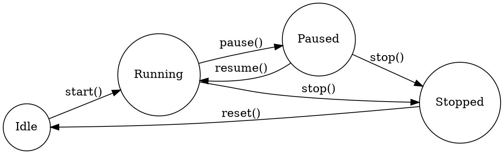
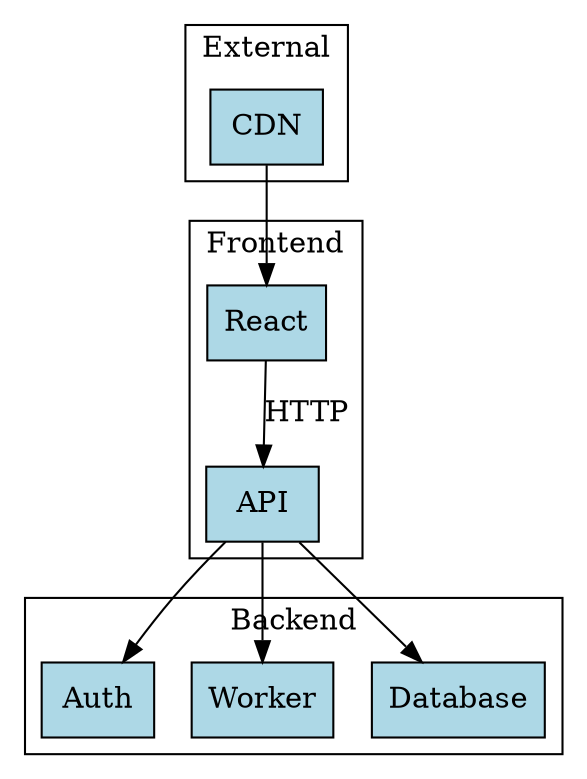

# Graphviz Diagrams

PiMD + PiDraw renders Graphviz DOT diagrams.

## Directed Graph

```dot title="State Machine"
digraph StateMachine {
    rankdir=LR;
    node [shape=circle];

    Idle -> Running [label="start()"]
    Running -> Paused [label="pause()"]
    Running -> Stopped [label="stop()"]
    Paused -> Running [label="resume()"]
    Paused -> Stopped [label="stop()"]
    Stopped -> Idle [label="reset()"]
}
```

## Flowchart

```dot
digraph Deployment {
    rankdir=TB;
    node [shape=box, style=filled, fillcolor=lightblue];

    subgraph cluster_frontend {
        label = "Frontend";
        React -> API [label="HTTP"];
    }

    subgraph cluster_backend {
        label = "Backend";
        API -> Auth;
        API -> Worker;
        API -> Database;
    }

    subgraph cluster_external {
        label = "External";
        CDN -> React;
    }
}
```
