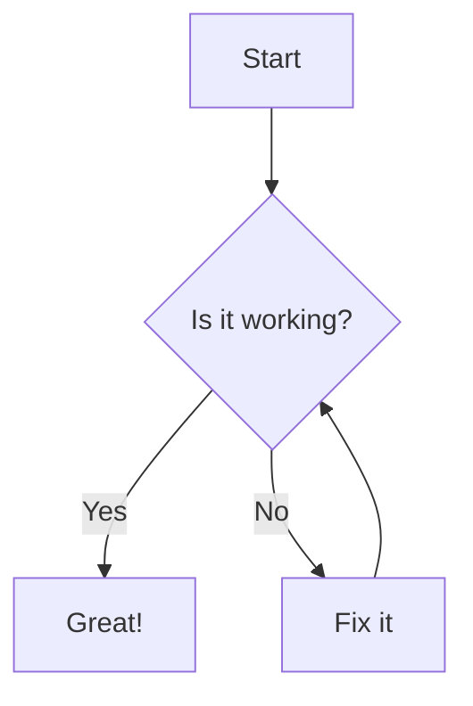
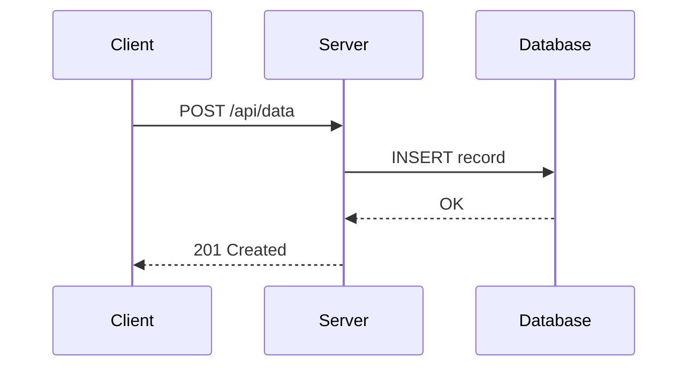
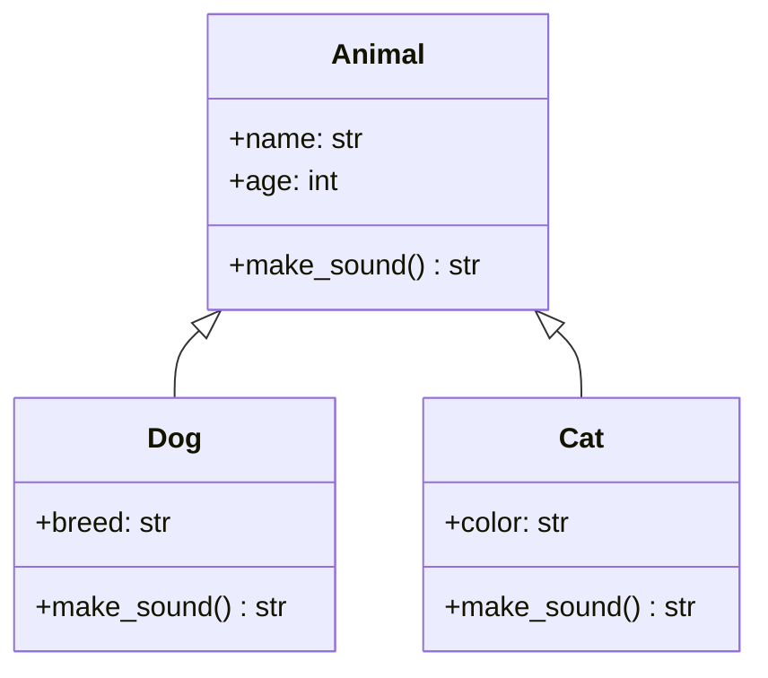
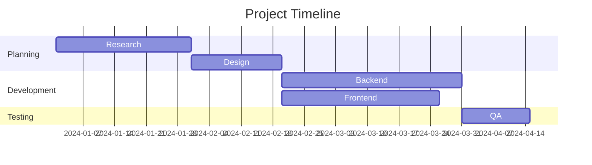

# Mermaid Diagrams

PiMD + PiDraw supports all Mermaid diagram types automatically.

## Flowchart

```mermaid title="Basic Flowchart"
graph TD
    A[Start] --> B{Is it working?}
    B -->|Yes| C[Great!]
    B -->|No| D[Fix it]
    D --> B
```

## Sequence Diagram

```mermaid title="API Request Flow"
sequenceDiagram
    participant Client
    participant Server
    participant Database

    Client->>Server: POST /api/data
    Server->>Database: INSERT record
    Database-->>Server: OK
    Server-->>Client: 201 Created
```

## Class Diagram

```mermaid
classDiagram
    class Animal {
        +name: str
        +age: int
        +make_sound() str
    }
    class Dog {
        +breed: str
        +make_sound() str
    }
    class Cat {
        +color: str
        +make_sound() str
    }
    Animal <|-- Dog
    Animal <|-- Cat
```

## Gantt Chart

```mermaid
gantt
    title Project Timeline
    dateFormat  YYYY-MM-DD
    section Planning
    Research           :a1, 2024-01-01, 30d
    Design             :a2, after a1, 20d
    section Development
    Backend            :b1, after a2, 40d
    Frontend           :b2, after a2, 35d
    section Testing
    QA                 :c1, after b1, 15d
```
