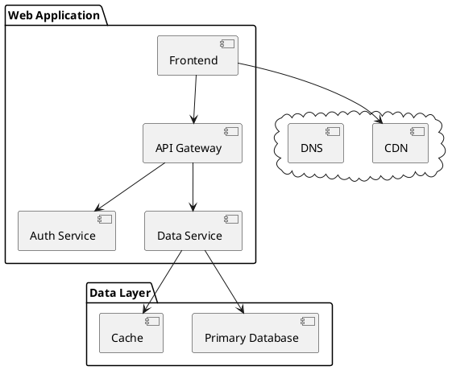
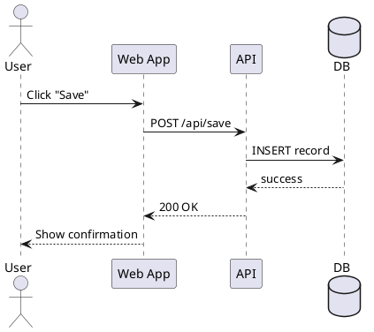
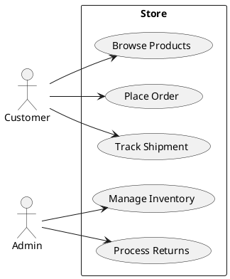

# PlantUML Diagrams

PiMD + PiDraw renders PlantUML diagrams natively.

## Component Diagram

```plantuml title="System Architecture"
@startuml
package "Web Application" {
    [Frontend] --> [API Gateway]
    [API Gateway] --> [Auth Service]
    [API Gateway] --> [Data Service]
}

package "Data Layer" {
    [Data Service] --> [Primary Database]
    [Data Service] --> [Cache]
}

cloud {
    [CDN]
    [DNS]
}

[Frontend] --> [CDN]
@enduml
```

## Sequence Diagram

```plantuml
@startuml
actor User
participant "Web App" as WA
participant "API" as API
database "DB" as DB

User -> WA: Click "Save"
WA -> API: POST /api/save
API -> DB: INSERT record
DB --> API: success
API --> WA: 200 OK
WA --> User: Show confirmation
@enduml
```

## Use Case Diagram

```plantuml
@startuml
left to right direction
actor "Customer" as C
actor "Admin" as A

rectangle Store {
    C --> (Browse Products)
    C --> (Place Order)
    C --> (Track Shipment)
    A --> (Manage Inventory)
    A --> (Process Returns)
}
@enduml
```
