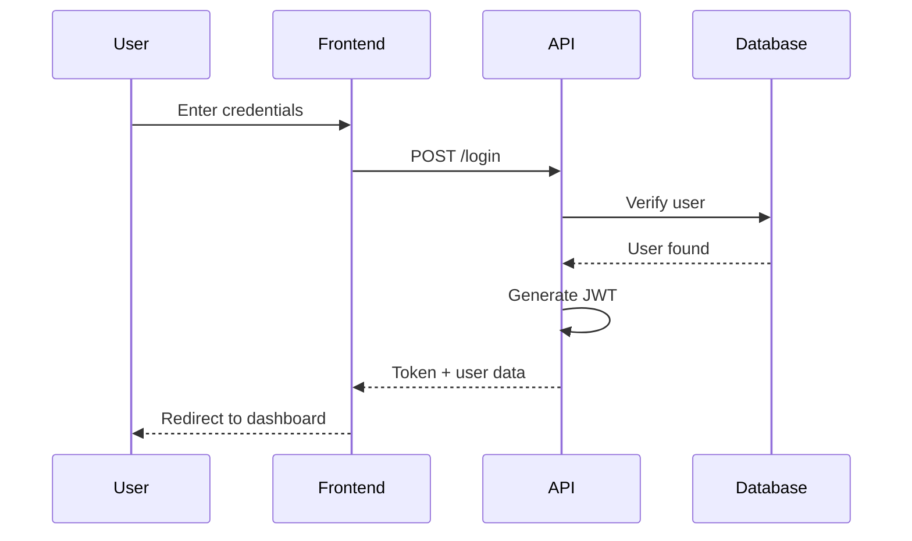
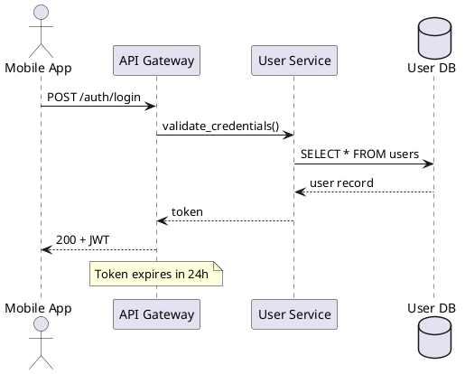

# Sequence Diagrams

PiMD + PiDraw supports sequence diagrams across multiple languages.

## Mermaid Sequence

```mermaid title="Login Flow"
sequenceDiagram
    participant User
    participant Frontend
    participant API
    participant Database

    User->>Frontend: Enter credentials
    Frontend->>API: POST /login
    API->>Database: Verify user
    Database-->>API: User found
    API->>API: Generate JWT
    API-->>Frontend: Token + user data
    Frontend-->>User: Redirect to dashboard
```

## PlantUML Sequence

```plantuml
@startuml
actor "Mobile App" as Mobile
participant "API Gateway" as GW
participant "User Service" as US
database "User DB" as DB

Mobile -> GW: POST /auth/login
GW -> US: validate_credentials()
US -> DB: SELECT * FROM users
DB --> US: user record
US --> GW: token
GW --> Mobile: 200 + JWT

note over GW: Token expires in 24h
@enduml
```
